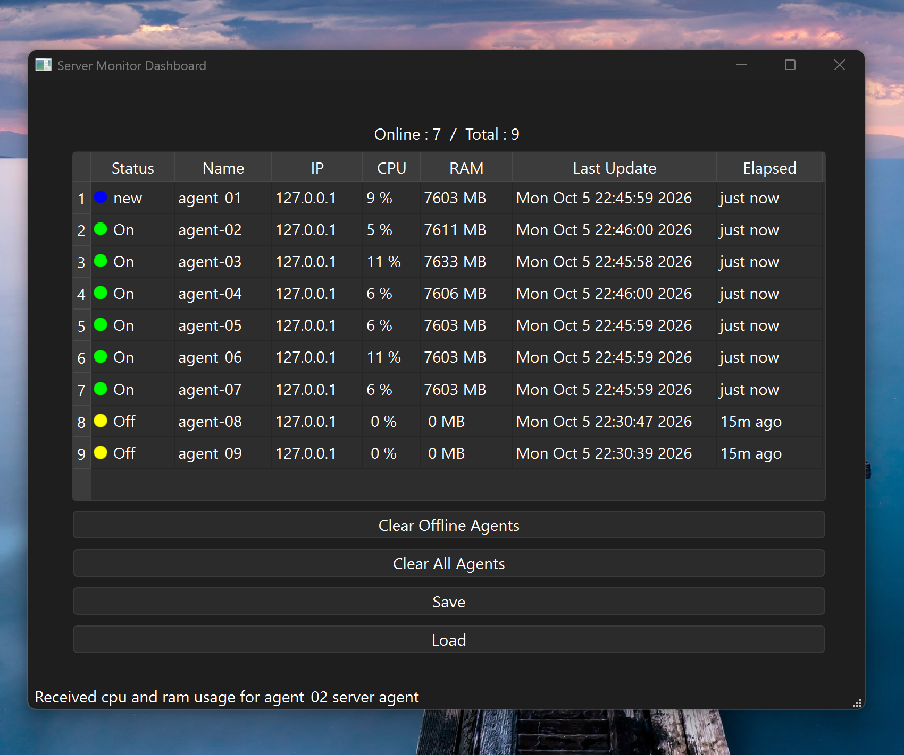

# ServerMonitor

A real-time server monitoring dashboard built with **Qt6** and **C++17**.

Agents run on remote machines, collect CPU and RAM metrics, and send them over TCP to a central dashboard that displays live status for all connected servers.





## Features

- Real-time CPU and RAM monitoring
- Multi-agent support (tested with 9 simultaneous agents)
- TCP-based communication between agents and dashboard
- Live status indicators (New / Online / Offline)
- Relative time display (Elapsed column)
- Save and load agent lists as JSON
- Clear offline or all agents with one click


## Architecture
```
[Agent 1]  ──TCP──┐

[Agent 2]  ──TCP──┤

[Agent 3]  ──TCP──┼──▶  [ServerMonitor Dashboard]

   ...           │

[Agent N]  ──TCP──┘
```

- **ServerAgent**: A lightweight Qt application that runs on each monitored machine, collects local CPU and RAM usage, and sends JSON-formatted metrics to the dashboard every 2 seconds.
- **ServerMonitor Dashboard**: A Qt-based GUI that listens for incoming agent connections, parses metrics, and displays them in a real-time table.


## Requirements

- Qt 6.5 or higher
- CMake 3.16+
- C++17 compatible compiler (MinGW or MSVC)
- Windows 10/11 (for real CPU/RAM metrics via Windows API)


## How to Build

Open the project in Qt Creator and press Run.


## How to Use

1. Start the **ServerMonitor Dashboard** — it will listen on port `12345`.
2. Start one or more **ServerAgent** instances (on the same machine or remote machines).
3. In each agent, set the dashboard's IP, port, and a unique agent name.
4. Click **Connect** in the agent.
5. The agent will appear in the dashboard's table and start sending metrics every 2 seconds.


## Roadmap

[x] TCP server and agent communication
[x] Real CPU/RAM metrics via Windows API
[x] Status coloring and elapsed time display
[x] Multi-agent support
[ ] Alerts for high CPU usage
[ ] Agent configuration persistence
[ ] Auto-reconnect in agent
[ ] Cross-platform agent (Linux/macOS)


## License

MIT License - see [LICENSE](LICENSE) file for details.