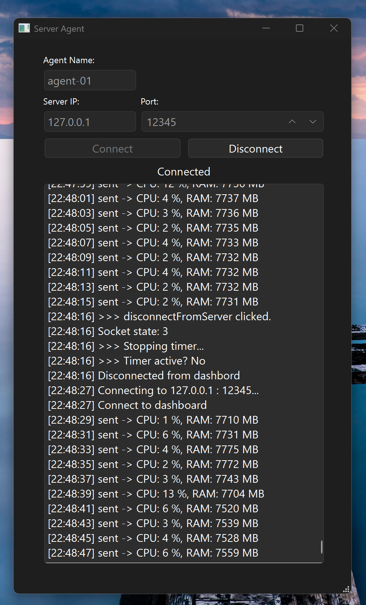

# ServerAgent

A lightweight Qt-based monitoring agent that runs on remote machines, collects real CPU and RAM metrics, and sends them over TCP to the [ServerMonitor Dashboard](https://github.com/safa-banak/ServerMonitorUI).

Built with **Qt6** and **C++17**.

## Features

- Real CPU and RAM metrics via Windows API
- TCP client that connects to a central dashboard
- Sends JSON-formatted metrics every 2 seconds
- Simple and clean Qt Widgets UI
- Live status indicator (Connected / Disconnected)
- Timestamped activity log
- Manual Connect / Disconnect control
- Agent name and server address are configurable

## How It Works

[ServerAgent] ──TCP──▶ [ServerMonitor Dashboard]
│
├── Collects local CPU usage (via GetSystemTimes)
├── Collects local RAM usage (via GlobalMemoryStatusEx)
└── Sends a JSON packet every 2 seconds:
{
"agent": "agent-01",
"cpu": 4,
"ram": 7512,
"timestamp": "2026-10-05T22:32:15"
}

## Requirements

- Qt 6.5 or higher (with Network module)
- CMake 3.16+
- C++17 compatible compiler (MinGW or MSVC)
- Windows 10/11 (for real CPU/RAM metrics via Windows API)

## How to Build

Open the project in Qt Creator and press Run.

Or build manually:
mkdir build && cd build
cmake ..
cmake --build .

## How to Use

1. Make sure the **ServerMonitor Dashboard** is running and listening on port `12345`.
2. Launch **ServerAgent**.
3. Fill in:
   - **Agent Name**: a unique name for this machine (e.g. `agent-01`)
   - **Server IP**: the dashboard's IP address (use `127.0.0.1` for local testing)
   - **Port**: the dashboard's listening port (default: `12345`)
4. Click **Connect**.
5. The agent will start sending metrics every 2 seconds. You'll see each packet logged in the activity panel.
6. Click **Disconnect** to stop sending metrics and close the connection.

## Roadmap

- [x] TCP client with connect/disconnect
- [x] Real CPU/RAM metrics via Windows API
- [x] JSON-formatted packets
- [x] Timestamped activity log
- [ ] Persistent configuration (save IP/port/name)
- [ ] Auto-reconnect on connection loss
- [ ] Cross-platform support (Linux/macOS)
- [ ] Configurable send interval

## Related Projects

- **[ServerMonitorUI](https://github.com/safa-banak/ServerMonitorUI)** — The central dashboard that receives metrics from this agent.
- **[Qt-Learning-Journey](https://github.com/safa-banak/Qt-Learning-Journey)** — The Qt learning path that led to this project.

## License

MIT License - see [LICENSE](LICENSE) file for details.